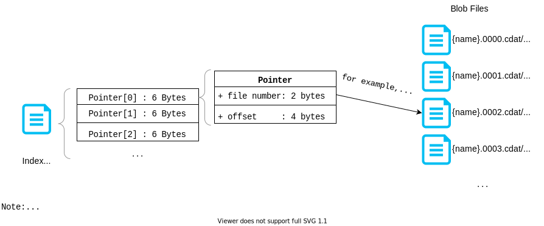

# Accessing Geth's Internal Database

## Problems

Projects analyzing existing blocks in the blockchain usually need to access
large number of blocks in the blockchain at once. However, accessing large
amount of blocks through the client may cause extremely high overhead.

Therefore, accessing Geth's internal database is the most efficient solution
in such project.

## Geth's Internal Database

Geth uses two databases to store the block data:
LevelDB, a key-value store, stores the blocks generated in recent ~15 days;
FreezerDB, a Geth customized database, stores any block that is older.

The FreezerDB is append-only, and more compact comparing to the LevelDB, thus,
it can help saving a lot of space for blocks that are unlikely to be modified.
However, we couldn't find any detailed documentation on how to access the
FreezerDB outside of Geth, as of the time we were working on our experiment.
Thus, we read through source code of the FreezerDB in *go-ethereum*, and rewrite
part of the code (mainly the code for reading data) in Python.

In the following subsections, we are going to introduce how to access
the blocks in both DBs, and an overview of the internal structure of FreezerDB
that we learn from reading the code.

### LevelDB

LevelDB is an open-source key-value store, so there are many existing LevelDB
connector available.
Here we only introduce how to fetch the block header from the database.

Geth stores **block header** as a *value* that is bound with the
**block number and header hash** as the *key*.
In addition, **header hash** can be found by giving the **block number**.

Nonetheless, the key used is actually in special encoding.
And here is the detail:
1. `(\b + Block_Num.to_bytes() + \n) -> Hash(Block_Header)`
	1. use byte value `\b` (i.e., `0x62`) as prefix
	2. concatenate with bytes that is converted from block number integer
	3. concatenate with byte value `\n` (i.e., `0x6E`) as suffix
	4. Now the key is formed; give this key to LevelDB to get the value, which is the hash of the block header
2. `(\b + Block_Num.to_bytes() + Hash(Block_Header)) -> Block_Header`
	1. use byte value `\b` (i.e., `0x62`) as prefix
	2. concatenate with bytes that is converted from block number integer
	3. concatenate with the hash of block header, which is a bytearray we got from the previous step
	4. Now the key is formed; give this key to LevelDB to get the value, which is the block header encoded in RLP.

### FreezerDB

FreezerDB is an append-only data structure (or database) customized by Geth.
In FreezerDB, there could be many different tables, each consist of
**a index file** and **a number of blob files**.
The figure below provides an overview of this data structure.

- **Index File** contains an array of pointers.

- **Pointer** contains a file number of the blob file, and an offset in that file.
So it points to a specific position in a specific blob file.

- **Blob File** contains only raw/compressed binary data pointed by the pointer.

- **Compression**: The data stored in the blob file could be compressed by
*Snappy*. This can be seen from the file suffix: if it begins with `c`, the data
is compressed, otherwise, it is not.

Thus, to find a block header, we first use the block number to get the pointer
from `headers.cidx` index file.
Next, we use this pointer to open the corresponding blob file, and seek to the
position given by `offset`.
The end of the data is pointed by the next pointer in the array.
With the begin pointer and end pointer, we can fetch the entire data
from the blob file.
Based on the file suffix, we know the data is compressed, thus, we pass this
binary data to Snappy library, which will decompress the data for us.

**NOTE**: This documentation only provides an overview of the FreezerDB from
our understanding, so some details are omitted.
For more details please refer to the code.
The FreezerDB code re-written in Python can be found at `FreezerTable.py` in
our repository.
The original source code written in Go is available in *go-ethereum* at
[https://github.com/ethereum/go-ethereum/blob/master/core/rawdb/freezer_table.go](https://github.com/ethereum/go-ethereum/blob/master/core/rawdb/freezer_table.go)
